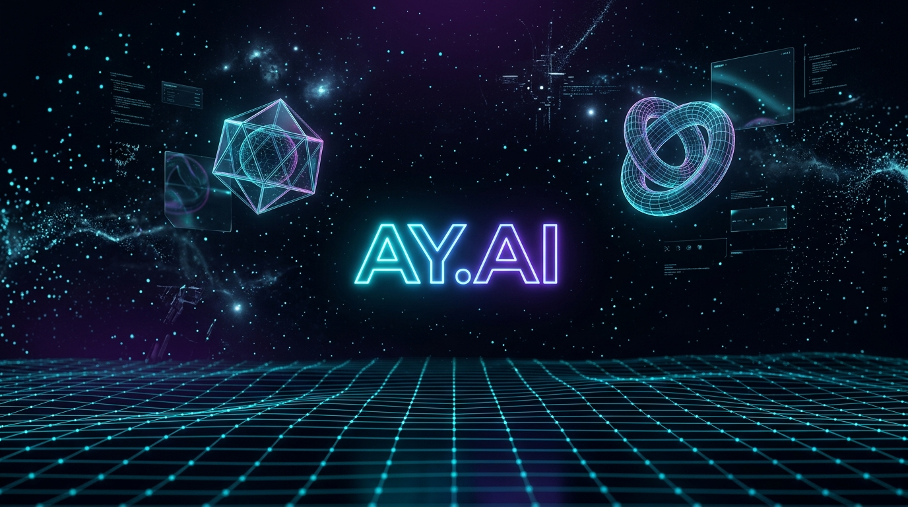

<p align="center">
  
</p>

<h1 align="center">✦ AY.AI — Aditya Yadav's 3D Spatial Portfolio</h1>

<p align="center">
  <strong>An immersive, hardware-accelerated WebGL portfolio featuring a Three.js cosmos, scroll-driven character animations, interactive cyber terminal, and spatial audio — built with Vite, Motion, and vanilla JavaScript.</strong>
</p>

<p align="center">
  <a href="https://aditya-yadav007.github.io/eradityayadav.com/">
    
  </a>
  
  
  
  
</p>

---

## 📋 Table of Contents

- [Overview](#-overview)
- [Live Demo](#-live-demo)
- [Key Features](#-key-features)
- [Tech Stack](#-tech-stack)
- [Project Architecture](#-project-architecture)
- [Getting Started](#-getting-started)
- [Available Scripts](#-available-scripts)
- [Deployment](#-deployment)
- [Customization](#-customization)
- [Performance](#-performance)
- [Browser Support](#-browser-support)
- [License](#-license)
- [Contact](#-contact)

---

## 🌌 Overview

This is the personal portfolio and engineering showcase of **Aditya Yadav** — a Final-Year B.Tech (CSE - AI & ML) student specializing in RAG systems, data analytics, and machine learning. The portfolio is designed as a **3D spatial experience** rather than a traditional static website, featuring:

- A real-time **WebGL particle cosmos** with mouse-reactive parallax
- Scroll-driven **character walking system** with sprite cycling
- An executable **cyber terminal** (`<AdityaOS />`) with full resume data
- **Spatial audio synthesis** using the Web Audio API (zero audio files)
- Three switchable **color themes** (Cyan Cyber, Violet Nebula, Emerald Matrix)
- **3D tilt cards** with specular highlights for project showcases

---

## 🚀 Live Demo

**👉 [aditya-yadav007.github.io/eradityayadav.com](https://aditya-yadav007.github.io/eradityayadav.com/)**

> Best experienced on desktop with a modern browser. Mobile fully supported.

---

## ✨ Key Features

| Feature | Description |
|---|---|
| **WebGL Cosmos** | 1,200 gradient-blended particles with additive blending, mouse-repelling force fields, and fog depth |
| **Cyber Grid** | Infinite wireframe ground plane with sinusoidal wave undulations animated in real-time |
| **Floating Holographics** | Wireframe icosahedron and torus knot with emissive glow, orbiting in 3D space |
| **3D Hero Card** | Pointer-tracked perspective tilt with specular radial highlight |
| **Character Walking Track** | Scroll-driven sprite cycling across a timeline with chapter milestones |
| **AI Companion Dock** | Contextual character remarks that change based on which section is in view |
| **Interactive Terminal** | Full CLI emulator with commands: `whoami`, `skills`, `projects`, `resume`, `contact`, and more |
| **Spatial Audio** | Web Audio API synthesized drone oscillators with LFO filter modulation — no audio files needed |
| **3 Color Themes** | Cyan Cyber · Violet Nebula · Emerald Matrix — live-swappable with 3D scene color sync |
| **Motion Animations** | Scroll-linked progress bar, staggered card reveals, count-up statistics, spring physics |
| **Project Modals** | Detailed deep-dive modals for each project with highlights, tech tags, and live demo links |
| **Contact Form** | FormSubmit.co integration with validation, confetti celebration, and mailto fallback |
| **Responsive Design** | Fully responsive from 320px mobile to 4K desktop with adaptive particle counts |
| **SEO Optimized** | Full meta tags, Open Graph, semantic HTML, sitemap, and robots.txt |

---

## 🛠 Tech Stack

| Layer | Technology |
|---|---|
| **Build Tool** | [Vite 8](https://vite.dev/) — Lightning-fast HMR & optimized production builds |
| **3D Engine** | [Three.js r186](https://threejs.org/) — WebGL renderer, particles, geometries, lighting |
| **Animation** | [Motion 13](https://motion.dev/) — Scroll-linked physics, inView triggers, spring easing |
| **Confetti** | [canvas-confetti](https://www.npmjs.com/package/canvas-confetti) — Celebratory particle bursts |
| **Audio** | Web Audio API — Synthesized oscillators, filters, and LFO modulation |
| **Styling** | Vanilla CSS — OKLCH color space, glassmorphism, CSS custom properties |
| **Typography** | Google Fonts — Syne (display), Plus Jakarta Sans (body), JetBrains Mono (code) |
| **Deployment** | [gh-pages](https://www.npmjs.com/package/gh-pages) — GitHub Pages deployment |
| **Forms** | [FormSubmit.co](https://formsubmit.co/) — Serverless form handling |

---

## 📁 Project Architecture

```
eradityayadav.com/
├── index.html                  # Main SPA entry — all sections (1,419 lines)
├── vite.config.js              # Vite config with code-splitting for Three.js & Motion
├── package.json                # Dependencies, scripts & project metadata
├── LICENSE                     # MIT License
│
├── src/                        # Source modules
│   ├── main.js                 # App entry — glues all systems together
│   ├── scene3d.js              # Three.js cosmos, grid, floating geometries
│   ├── character.js            # Walking sprite engine, 3D card tilt, companion dock
│   ├── terminal.js             # Interactive CLI emulator (<AdityaOS />)
│   ├── audio.js                # Web Audio API spatial sound synthesizer
│   ├── motionSetup.js          # Motion scroll/inView animations & stat counters
│   ├── style.css               # Complete design system (3,670 lines)
│   └── assets/                 # Processed source assets
│       ├── hero.png
│       ├── javascript.svg
│       └── vite.svg
│
├── public/                     # Static assets (copied to dist as-is)
│   ├── favicon.png
│   ├── favicon.svg
│   ├── icons.svg               # SVG sprite sheet
│   ├── robots.txt              # SEO crawler directives
│   ├── sitemap.xml             # Search engine sitemap
│   ├── 404.html                # Custom 404 with SPA redirect
│   └── assets/
│       ├── aditya_photo.jpg    # Hero portrait
│       ├── ADITYA_RESUME.pdf   # Downloadable resume
│       ├── character/          # 21 character sprite PNGs
│       │   ├── 01_standing.png
│       │   ├── 02_walking_1.png
│       │   ├── ...
│       │   └── full_sheet.jpg
│       └── projects/           # 9 project preview images
│           ├── omni_ai.jpg
│           ├── airbnb_analysis.png
│           ├── netflix_dashboard.png
│           └── ...
│
└── assets/                     # Root-level assets (resume PDF)
    └── Aditya_Yadav_Resume_Final.pdf
```

---

## 🏁 Getting Started

### Prerequisites

- **Node.js** ≥ 18.x
- **npm** ≥ 9.x (comes with Node.js)

### Installation

```bash
# 1. Clone the repository
git clone https://github.com/Aditya-yadav007/eradityayadav.com.git
cd eradityayadav.com

# 2. Install dependencies
npm install

# 3. Start development server
npm run dev
```

The dev server will start at `http://localhost:5173` with hot module replacement (HMR).

---

## 📜 Available Scripts

| Command | Description |
|---|---|
| `npm run dev` | Start Vite dev server with HMR at `localhost:5173` |
| `npm run build` | Build optimized production bundle to `dist/` |
| `npm run preview` | Preview the production build locally |
| `npm run deploy` | Build + deploy to GitHub Pages via `gh-pages` |

---

## 🌐 Deployment

This project is configured for **GitHub Pages** deployment:

```bash
# One-command deploy
npm run deploy
```

This runs `vite build` (via `predeploy`) and then publishes the `dist/` directory to the `gh-pages` branch.

### Production Build Details

The Vite config includes intelligent **code splitting** to keep bundle sizes optimal:

| Chunk | Contents | Size (gzip) |
|---|---|---|
| `index.js` | App logic, terminal, character, audio | ~25 KB |
| `motion.js` | Motion animation library | ~18 KB |
| `three.js` | Three.js 3D engine | ~132 KB |
| `index.css` | Complete design system | ~10 KB |

---

## 🎨 Customization

### Switching Color Themes

Three themes are built in and can be switched live via the UI dots in the header:

| Theme | Primary | Hue |
|---|---|---|
| **Cyan Cyber** (default) | `oklch(0.78 0.18 195)` | `195` |
| **Violet Nebula** | `oklch(0.76 0.24 300)` | `290` |
| **Emerald Matrix** | `oklch(0.82 0.22 155)` | `155` |

To add a new theme, update:
1. `src/style.css` — Add a `[data-theme="yourtheme"]` block
2. `src/scene3d.js` — Add colors to the `this.colors` object
3. `index.html` — Add a theme dot button in the header

### Terminal Commands

The cyber terminal (`<AdityaOS />`) supports these commands:

```
whoami       — Professional summary & background
skills       — AI/ML, Data Analytics & Software tech matrix
education    — B.Tech, Diploma & Schooling details
internships  — AICTE VOIS, NetCamp, IBM SkillBuild
projects     — DocChat, BachatAI, Airbnb EDA, Twitter Sentiment
resume       — Download official verified PDF resume
socials      — LinkedIn, GitHub, Instagram links
certs        — CISCO, Infosys, NPTEL, TCS iON, ISRO credentials
contact      — Email, Phone & direct links
clear        — Clean terminal buffer
```

---

## ⚡ Performance

- **Adaptive particle count**: 1,200 particles on desktop, 500 on mobile
- **Dynamic pixel ratio**: Capped at 2x on desktop, 1.5x on mobile
- **Code splitting**: Three.js and Motion loaded as separate async chunks
- **Font optimization**: `dns-prefetch` + `preconnect` for Google Fonts
- **CSS preloading**: Stylesheet loaded via `<link rel="preload">`
- **Passive scroll listeners**: All scroll handlers use `{ passive: true }`
- **Chunk size limit**: Raised to 1,000 KB to suppress warnings for Three.js

---

## 🌐 Browser Support

| Browser | Support |
|---|---|
| Chrome 90+ | ✅ Full |
| Firefox 90+ | ✅ Full |
| Safari 15+ | ✅ Full |
| Edge 90+ | ✅ Full |
| Mobile Chrome/Safari | ✅ Responsive |

> Requires WebGL 2.0 support for the 3D background scene.

---

## 📄 License

This project is licensed under the **MIT License** — see the [LICENSE](LICENSE) file for details.

---

## 📬 Contact

<p align="center">
  <strong>Aditya Yadav</strong><br />
  AI/ML Engineer · Data Analyst · Python Developer
</p>

<p align="center">
  <a href="mailto:itsadityayadav35@gmail.com">
    
  </a>
  <a href="https://linkedin.com/in/aditya-yadav-aky/">
    
  </a>
  <a href="https://github.com/Aditya-yadav007">
    
  </a>
</p>

<p align="center">
  <a href="tel:+917267001135">📞 +91 7267001135</a> · 📍 Prayagraj, Uttar Pradesh, India
</p>

---

<p align="center">
  <em>Built with ❤️ using Three.js, Motion & Vite — Engineered by Aditya Yadav</em>
</p>
